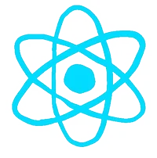

<h3 align="center"><  Hello there />, I'm Andrew, a creative fullStack developer from Ohio</h3>

---

- 🔭 I’m currently building data-driven React-packed, full-stack applications
- 🌱 I’m currently learning more about React.js and Jamstack
- 🤔 I’m looking to create the perfect fetch with GraphQL

### Languages and Tools:

  
  
  
  
  
  
  
  
  
  

 
